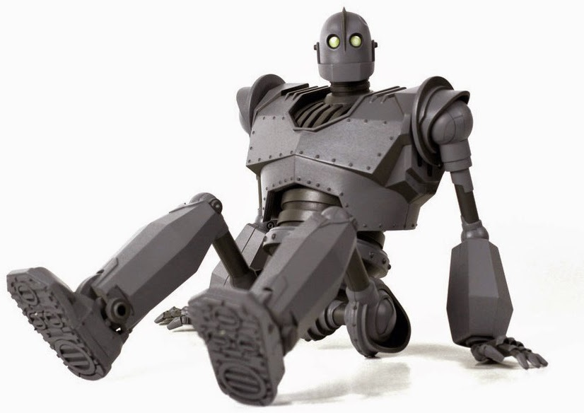

<head>
<link href="https://fonts.googleapis.com/css2?family=Patua+One&family=Roboto&display=swap" rel="stylesheet">

### ICP-3042 New Technologies
----
# **Assignment 1** 

## **Max Petts** *- eeub35*
### 📆 - 21.11.2020

----
## Intro
This document details the processes taken to produce my humanoid model. My model will be based on the protagonist from the film 'The Iron Giant'.

## References

<ul>
	<li>
		<h5>Fig 1: The Iron Giant front reference</h5>
	</li>
	<li>
		<h5>Fig 2: The Iron Giant back reference</h5>
	</li>
	<li>
		<h5>Fig 3: The Iron Giant sitting down</h5>
	</li>
	<li>
		<h5>Fig 4: The Iron Giant squatting</h5>
	</li>
	<li>
		<h5>Fig 5: A full reference image of The Iron Giant</h5>
	</li>
</ul>

 

\pagebreak

## Week 1
<ul>
  <li>
    <h5>Fig 6: 1st revision of the foot</h5>
  </li>
  <li>
<h5>Fig 7: Iron Giants leg</h5>
  </li>
</ul>
>
Spent most of this week getting the scale correct on the feet, although this will probably get tweaked throughout. Planning on adding more details later - wanted to get the base completed first. Used *Fig 4* as reference for the knee joint.

## Week 2
<ul>
  <li>
    <h5>Fig 8: The humanoids hips, legs and feet</h5>
  </li>
  <li>
    <h5>Fig 9: Torso completed</h5>
  </li>
  <li>
    <h5>Fig 10: Back of model with torso</h5>
  </li>
</ul>

Spent the first half of the week getting the hip cut out right: used bisect to cut the faces and then manually dragged the vertices to create the curved look. Next biggest challenge was the torso cut out at the front, which was achieved using loop cuts and removing the faces. The shoulder curve was done using a bool tool.

## Week 3
<ul>
  <li>
    <h5>Fig 11: Arms completed</h5>
  </li>
  <li>
    <h5>Fig 12: Frontal view of Iron Giant with arms</h5>
  </li>
</ul>

Focused on perfecting the head and jaw shape this week. The arms were made by using a shrinkwrap modifier to project a circle onto the sphere in the shoulder. This circle was then extruded and scaled again and again until the desired shape from *Fig 5* was achieved.

## Week 4
<ul>
  <li>
    <h5>Fig 13: Hands added onto model</h5>
  </li>
  <li>
    <h5>Fig 14: Rear view of model with hands</h5>
  </li>
  <li>
    <h5>Fig 15: Model with final touches</h5>
  </li>
</ul>

This week was spent creating the hands, polishing the model up and adding little details, such as rivet/bolts. The bolts could be improved by breaking the faces up they are on to join with the sphere, instead of them just intersecting.

